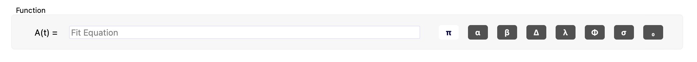
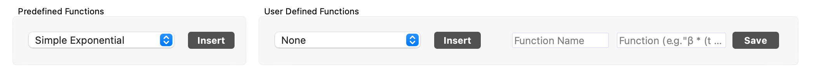
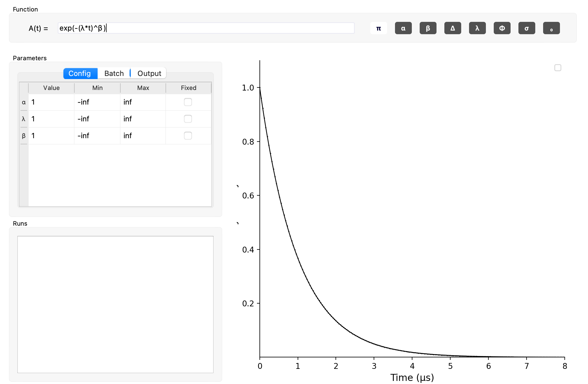

[]()
###  Features

- Convert binary data files from multiple µSR facilities.
- Display and interact with multiple sets of data.
- Write your data to a common file type.
- Compatible with Linux, Mac and Windows

# BEAMS
> A simple interface for visualizing and analyzing µSR data.

## Table of Contents
- [Getting Started](#getting-started)
- [User Guide](#user-guide)
  - [Plotting Asymmetries](#plotting-asymmetries)
    - [Plotting the Asymmetry](#plotting-the-asymmetry)
    - [Interacting with the Asymmetry](#interacting-with-the-asymmetry)
  - [Fitting Asymmetries](#fitting-asymmetries)
    - [Choosing the Fit Expression](#choosing-your-fit-expression)
    - [Setting the Fit Parameters](#setting-the-fit-parameters)
    - [Saving Fits](#saving-fits)
    - [Additional Features](#other-fit)
      - [Saving Custom Fit Expressions](#saving-custom-fit-expressions)
      - []
  
  
    - [Fit Parameters](#fit-parameters)
    - [Selecting Runs](#selecting-runs)
    - [Fit Options](#fit-options)
- [File Formats](#file-formats)
  - [External File Formats](#external-supported-file-formats)
  - [BEAMS File Formats](#beams-file-formats)
- [Troubleshooting](#troubleshooting)

## Getting Started

### Prerequisites
- Python 3.6 or greater

### Installation
- Download or clone this repository.
- Open a terminal and navigate to the BEAMS folder.

#### Without Anaconda
- Run the following command to install the package requirements for BEAMS
```shell
$ python -m pip install -r python_requirements.txt
```
#### Anaconda
- Run the following command in the anaconda prompt to install requirements.
```shell
$ conda install -c anaconda --file conda_requirements.txt
```

Start BEAMS for either, once you have navigated to the directory with the following
```shell
$ python beams
```

## User Guide


### Loading Files
By clicking the + button in the top left corner you will launch a prompt with four options of adding files. 
From disk (your computer), and then three different facilities: Triumf, PSI and ISIS. 

When you download files from one of the three facilities, they need to be converted from their binary format
to a format that our program can work with. You can do this by 'checking' the box next to each file you want
to convert and pressing the 'convert' button. New files with the '.dat' extension will be created.

Once you have files in a format that our program can read you select the files you want to work with by checking
the boxes and clicking the 'load' button. This loads the data from these files into the program and you are now
ready to interact with the data. 

### Plotting Asymmetries
#### Plotting the Asymmetry
Once your files are loaded, if they are files that can be plotted then they will show up in the file tree below 
the plotting buttons. Depending on the type of file you loaded, checking the box next to the file and clicking 
'plot' may do one of three things. 

If it is a '.dat' file, a file which contains histograms, a prompt will appear which will ask you to select which 
histograms should be used to calculate the asymmetry for that particular file. If you intend to use the same histograms
for a large selection of files then you can press 'Apply All', otherwise you can press 'Apply' and specify for each file
individually.


If it is a '.asy' file, a file which contains an asymmetry, then the asymmetry will be plotted as no more
information is needed.

If it is a '.fit' file, a file which contains an experimental asymmetry and an asymmetry calculated from a fit then
the experimental asymmetry will be plotted with another plotted line for the calculated asymmetry.

#### Interacting with the Asymmetry
Once your asymmetry is plotted, you can now dynamically interact with it! You can experiment with this by moving 
the slider below each plot to adjust the binning of the asymmetry and adjust the x and y limits to focus in on different
areas. In the left side panel you will see the legend for the plots, as well as options for styling and adjusting
the alpha parameter for the asymmetry.


### Fitting Asymmetries
#### Choosing your Fit Expression

Near the top of the fitting tab you can see an area where you can provide the fitting expression as a function of 't'. Operations must be typed out explicitly (i.e. use '5*x' rather then '5x'). If the expression you provide is invalid, the box will be highlighted in red.

<br>


Above the input for the expression you will see two boxes. The box on the left (Predefined Functions) contains some common function definitions that come loaded with the program. You can select the template you want to use and press 'Insert'. This will insert the function into the expression input box below (wherever your cursor is at in the box or at the end of the input if your cursor is not in it).

The box on the right (User Defined Functions) allows you to create a new function definition (with a specified name) and save it for future use. You can select from previously saved definitions and press 'Insert' to achieve the same behavior as described above.

<br>


Reserved Symbols | + | - | * | / | ^ | i | e | π | pi
--- | --- | --- | --- | --- | --- | --- | --- | --- | ---

Functions - f(...) | sin | cos | tan | sinh | cosh | tanh | exp
--- | --- | --- | --- | --- | --- | --- | ---


<br>

#### Specifying your Fit Parameters
When you provide a valid fit expression you will see the table of parameters and the plot display below the input box update as you type. Below is an example of valid input.



As you can see, the fit expression has two free variables (λ and β) and a third variable 'α' (this is a reserved symbol for the alpha value of the asymmetry). All three of these are accounted for in the parameter table.

The parameter table also has three separate sections you can interact with; Config, Batch and Output. Each of the three will be explained in depth. 

###### Config

This is the first section of the parameter table shown above. There will be a row for each free variable and an additional row for α. For each parameter you can adjust the initial value used in the fit, the lower and upper bounds for that parameter, and whether or not that parameter should be fixed to the value provided.

- Note - Adjusting a free variable will be reflected in the fit lines in the plot display. Adjusting alpha will be reflected in the asymmetry being plotted.

###### Batch

In the second section of the parameter table, you will once again see rows for each parameter with two new columns for each; Global and Run-Specific. For each parameter, you can only have ONE box checked (checking one will make the other box uncheckable).


By checking global, you are indicating that you want the parameter to be fit across all datasets - not individually for each.

By checking run-specific, you are indicating that you want to be able to specify every column in the config section (even the fixed column) individually for each run. For example, you get set the initial value for λ for one run to 2.0 and for another run to 3.0. By default, when you set the value that will be the initial value for every single run.-

- In order to assign values to individual runs, you select the runs (as shown below) and while they are selected you adjust the values in the config table. You will then find as you click through each run that the values have been applied and remembered.


- If you select multiple runs that have conflicting values in one column or another for a parameter marked as run-specific, you will see a ' * ' in that cell or, if it is the fixed column, you will see a partial checkmark. If you adjust that cell then all conflicting values will be overwritten, otherwise if you don't edit it then they will remain unchanged.


###### Output

In the third section of the parameter table, you will see rows for each parameter and two new columns; Value and Uncertainty. These columns are only filled out after you have run a fit. When you select a fit on the left hand side panel, the value and uncertainty of the calculated parameters will be displayed here. If you select multiple fits at one time, a ' * ' will be placed in cells where there are conflicting values. 


## File Formats

### External Supported File Formats
NOTE: Support for ISIS files is currently on the docket, but not yet supported.

File Extension | Description
-------------- | -----------
.msr | Histogram data from TRIUMF
.bin | Histogram data from PSI
.mdu | Histogram data from PSI

### BEAMS File Formats
File Extension | Description
-------------- | -----------
.dat | Histogram data for a single run.
.asy | Experimental asymmetry, uncertainty and time for a single run.
.fit | Experimental and calculated asymmetry, uncertainty and time for a single run.
.clc | A verbose summary of a fit
.beams | A saved beams session

## Troubleshooting
#### Can't install requirements on Mac (Apple Silicon)
For trouble installing requirements on Apple Silicon see the answer to this [issue](https://github.com/scipy/scipy/issues/13409).

```shell
$ brew install openblas
$ pip install cython pybind11 pythran numpy
$ OPENBLAS=$(brew --prefix openblas) CFLAGS="-falign-functions=8 ${CFLAGS}" pip install --no-use-pep517 scipy
```

#### Text in file trees is truncated
If the text is truncated or the items on the screen are misaligned slightly you most likely don't have PyQt5 installed (you can confirm this by running `pip freeze` in the terminal and you will probably see QtPy). Simply fix by using pip to install PyQt5.
 
```shell
$ pip install PyQt5
```

#### (PyQt5) ImportError: DLL load failed
Resolved in this [Issue 37](../../issues/37)

Possible solution in the answer to this question on Stack Overflow: https://stackoverflow.com/questions/42863505/dll-load-failed-when-importing-pyqt5
